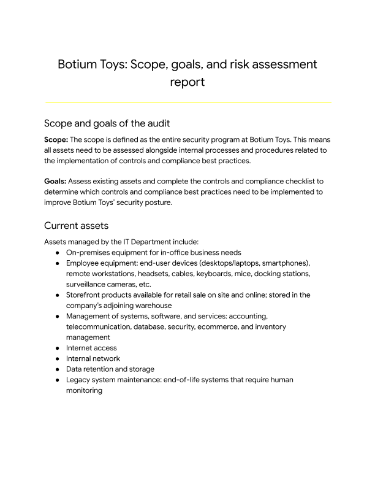

# Internal Security Audit

## Introduction

## Objective
The objective of this project is to conduct an internal security audit. Audits help ensure that security checks are made, to monitor for threats, risks, or vulnerabilities that can affect an organization’s business continuity and critical assets.

## Scenario
> <b>NOTE: This scenario is based on a fictional company:</b>

Botium Toys is a small U.S. business that develops and sells toys. The business has a single physical location, which serves as their main office, a storefront, and warehouse for their products. However, Botium Toy’s online presence has grown, attracting customers in the U.S. and abroad. As a result, their information technology (IT) department is under increasing pressure to support their online market worldwide.

The manager of the IT department has decided that an internal IT audit needs to be conducted. She expresses concerns about not having a solidified plan of action to ensure business continuity and compliance, as the business grows. She believes an internal audit can help better secure the company’s infrastructure and help them identify and mitigate potential risks, threats, or vulnerabilities to critical assets. The manager is also interested in ensuring that they comply with regulations related to internally processing and accepting online payments and conducting business in the European Union (E.U.).

The IT manager starts by implementing the National Institute of Standards and Technology Cybersecurity Framework (NIST CSF), establishing an audit scope and goals, listing assets currently managed by the IT department, and completing a risk assessment. The goal of the audit is to provide an overview of the risks and/or fines that the company might experience due to the current state of their security posture.

Your task is to review the IT manager’s scope, goals, and risk assessment report. Then, perform an internal audit by completing a controls and compliance checklist. 

## Tools / Supporting Materials
 - <a href="Files/Botium Toys_ Scope, goals, and risk assessment report.pdf" >Botium Toys: Scope, goals, and risk assessment report</a>
 - <a href="Files/Control categories.pdf" >Control Categories</a>
 - <a href="Files/Controls and compliance checklist.pdf" >Controls and Compliance Checklist (Completed)</a>

## Methodology
Using The company's Risk Assessment Report. I used a controlled categories checklist to perform a Security Audit and made recommendations to the company on how to impove thier risk score.

After reviewing the scope, goals, and risk assessment report details, with a focus on:

 - The assets currently managed by the IT department

 - The bullet points under “Additional comments” in the Risk assessment section

## Conclusion
